# 🏨 QuickStay – Modern Hotel Booking Platform

**QuickStay** is a full-stack hotel booking platform where users can search and book hotel rooms, while hotel owners manage listings and bookings. Powered by modern technologies like React (Vite), Node.js (Express), MongoDB, and Clerk for authentication, it offers seamless booking and management experiences for both users and hotel owners.

🌐 [Live Demo](https://quickstay-dclf8hnux-shantanus-projects-6dff41f7.vercel.app) &nbsp;&nbsp;&nbsp;💻 Built with ❤️ for real-world scalability

---

## ✨ Features

### 👤 User Features
- 🔍 Browse & search hotels by city or category
- 🛏️ View room details with amenities and photos
- 📅 Book rooms with real-time availability
- 💳 Secure payments via Stripe
- 📬 Booking confirmation emails
- 🔐 Clerk authentication & profile dashboard
  
- **Effortless Search:** Easily find hotels by destination, check-in/check-out dates, and number of guests.
- **Exclusive Deals:** Discover limited-time offers and special packages for enhanced stays.
- **Diverse Accommodations:** Browse a wide selection of hotels and villas in various cities.
- **Detailed Room Information:** View comprehensive details, images, and pricing for each room.
- **Guest Reviews:** Read testimonials from other travelers to make informed decisions.
- **Owner Dashboard:** For hotel owners to monitor bookings, track revenue, and manage room listings.
- **User-friendly Interface:** A clean and responsive design ensures a smooth Browse experience.
- **Secure Account Creation:** Register and log in securely to manage your bookings and preferences.

### 🛠️ Hotel Owner Features
- 🏨 Register as a hotel owner
- ➕ Add, edit, and delete hotel rooms with images
- 📊 Owner dashboard with bookings & revenue stats
- 📦 Upload hotel images via Cloudinary
- 🔒 Access owner-specific pages via protected routes

---

## 🖼️ App Screenshots
---

### Homepage - Discover Your Perfect Gateway Destination
The landing page of QuickStay, showcasing a visually appealing background and the main search functionality for destinations, check-in/check-out dates, and guests.
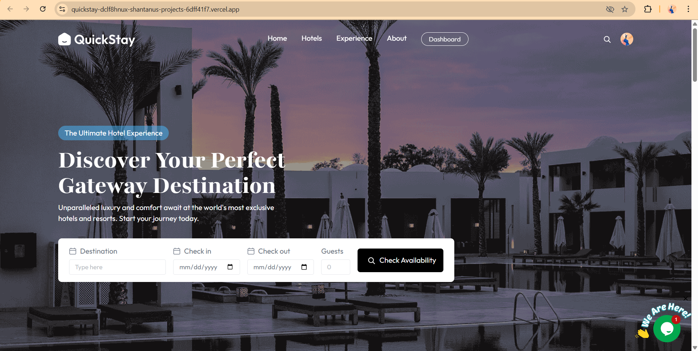

### Exclusive Offers
Explore special deals and discounts on various hotel packages, designed to enhance your stay.
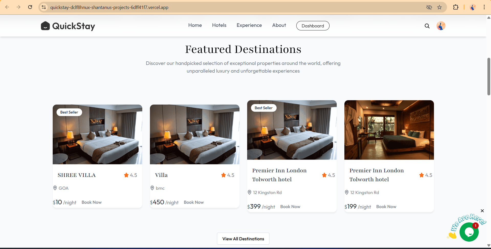

### Featured Destinations
A curated selection of top-rated hotels and villas in popular destinations.
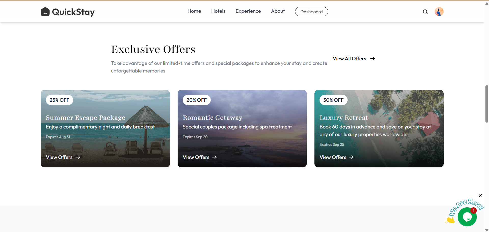

### Hotel Rooms Listing
Browse a list of available hotel rooms with filtering options by popular criteria and price range.
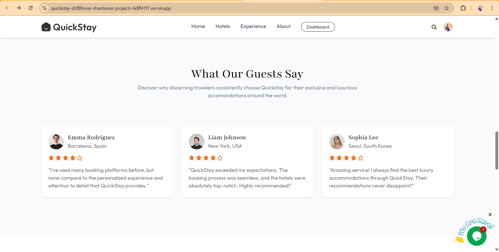

### Detailed Room View
A closer look at a specific hotel room, displaying multiple images, reviews, location, amenities, and pricing.


### Guest Testimonials
Hear what our satisfied guests have to say about their QuickStay experience.
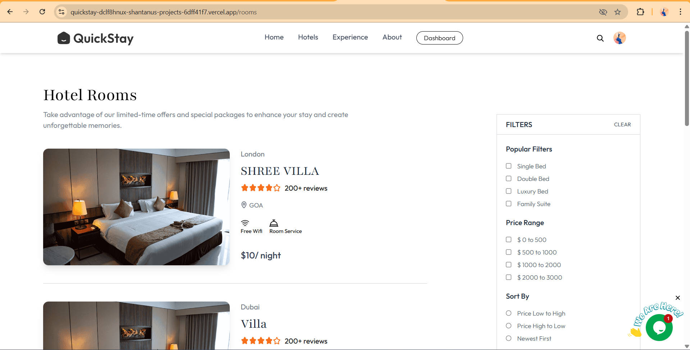

### Frequently Asked Questions (FAQs)
Answers to common questions about accommodations, availability, and special offers.
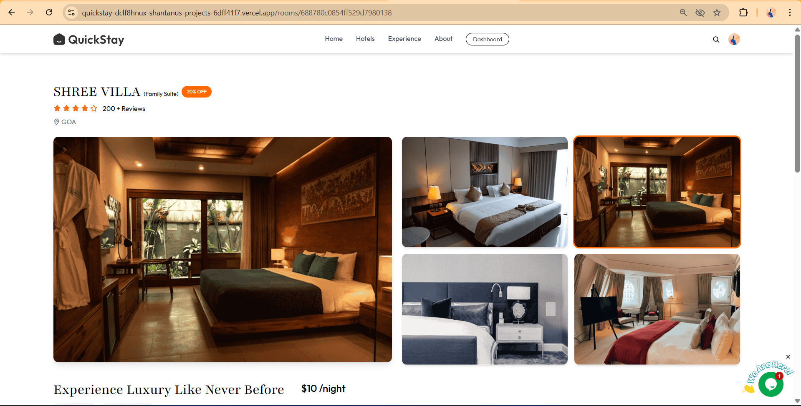

### Create an Account
The registration form for new users to create an account, offering options to continue with Google or use email.
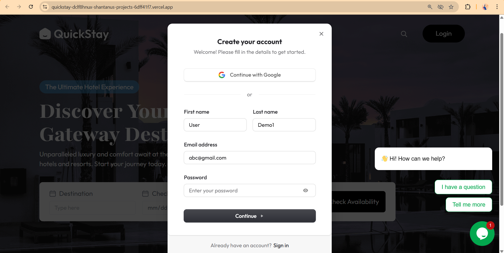

### Register Your Hotel
A modal form for hotel owners to register their hotel with QuickStay by providing details such as hotel name, phone, address, and city.
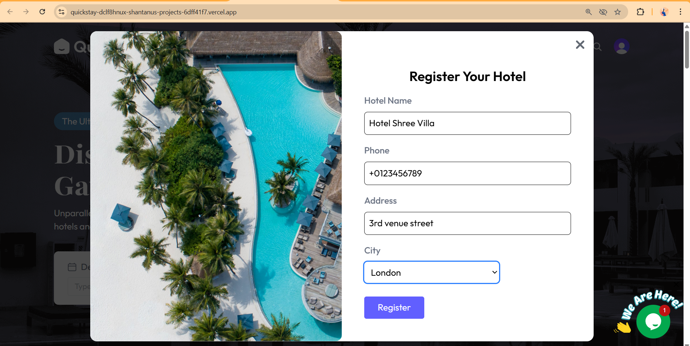

### Owner Dashboard
The administrative dashboard for hotel owners to monitor total bookings, track total revenue, and view recent bookings.
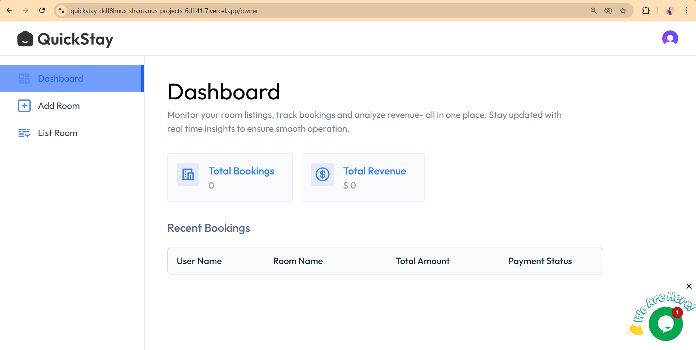

### My Bookings (Paid)
A user's booking history, showing a successfully paid reservation for "Hotel Shree Villa" with check-in and check-out dates.
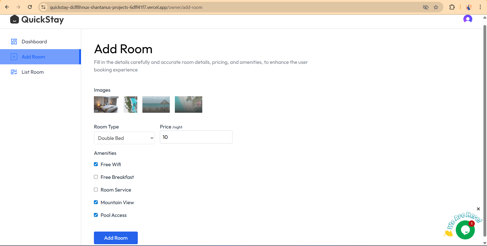

### Owner Dashboard with Live Chat
The hotel owner's dashboard displaying total bookings and revenue, along with a live chat interface on the right.
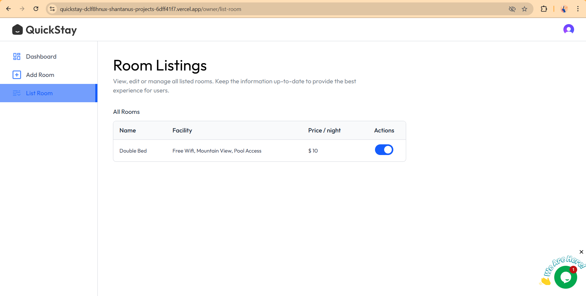

### Add Room
The interface for hotel owners to add new room listings, including options to upload images, specify room type, price, and amenities.
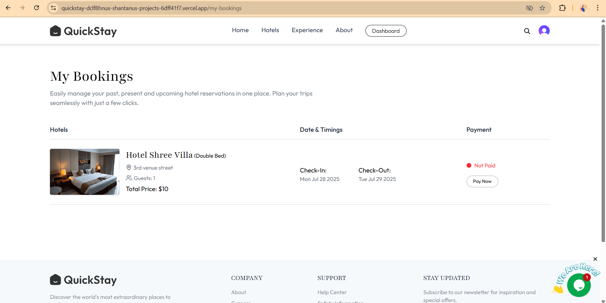

### Room Listings
A page displaying all listed rooms, their facilities, price per night, and an action toggle for availability.
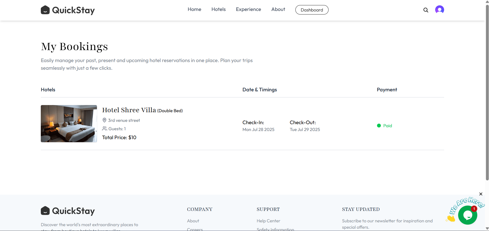

### My Bookings (Unpaid)
A user's booking history, showing an unpaid reservation for "Hotel Shree Villa" with an option to "Pay Now."
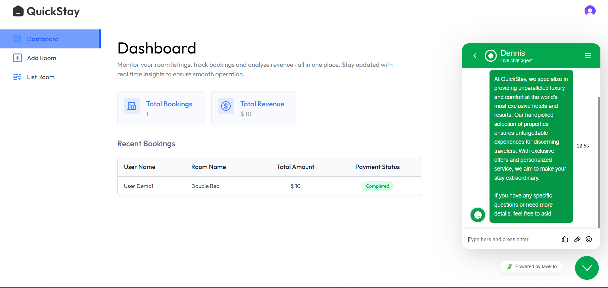


---

🔁 Frontend-Backend Flow
- React frontend sends authenticated API requests using Axios.
- Clerk manages user sessions; tokens are passed in headers.
- Backend verifies user via Clerk middleware.
- Cloudinary handles image uploads from hotel owners.
- Stripe processes booking payments and notifies backend.
- Inngest runs async workflows or serverless tasks.
- Nodemailer sends booking confirmation emails.


---

## 🧰 Tech Stack

| 🧩 Category        | ⚙️ Technologies                           |
|-------------------|-------------------------------------------|
| 🖼️ Frontend       | React (Vite), TailwindCSS                 |
| 🚀 Backend        | Node.js, Express.js                      |
| 💾 Database       | MongoDB (Mongoose ODM)                   |
| 🔐 Authentication | Clerk                                     |
| 💳 Payments       | Stripe                                    |
| ✉️ Emails         | Nodemailer                                |
| 📦 Media Storage  | Cloudinary                                |
| 🔄 Event Handling | Inngest                                   |
| ☁️ Hosting        | Vercel (Client), Render (Server)          |
| 📊 Monitoring     | Vercel Analytics & Speed Insights         |


---

## 📂 Folder Structure

```bash
QuickStay/
├── client/               # React Frontend
│   ├── src/
│   │   ├── assets/       # Static images/icons
│   │   ├── components/   # Shared UI components
│   │   ├── context/      # AppContext for global state
│   │   ├── pages/        # Main routes like Home, Rooms, Booking, Owner Dashboard
│   │   └── main.jsx      # React app entry
│   ├── public/
│   ├── .env.local        # Frontend environment variables
│   └── vite.config.js
│
├── server/               # Express Backend
│   ├── configs/          # Cloudinary, DB, Nodemailer config
│   ├── controllers/      # Logic for hotel, booking, user, stripe
│   ├── middleware/       # Auth & upload middleware
│   ├── models/           # Mongoose schemas
│   ├── routes/           # API route definitions
│   ├── inngest/          # Event handling logic
│   ├── .env              # Server environment variables
│   └── server.js         # Express server entry

```

---

## 🔧 Installation & Setup

### 📦 Backend (Express Server)
```bash
cd server
npm install
npm run server  # Starts server at http://localhost:5000
```

---


### 🌐 Frontend (React Vite App)
```bash
cd client
npm install
npm run dev     # Starts frontend at http://localhost:3000
```

---


###🙌 Acknowledgments
```bash
Clerk.dev – for Authentication
Stripe – for Payment Integration
Cloudinary – for Image Uploads
Nodemailer – for Email Notifications
Inngest – for Serverless Workflows
```

---

###🏆 Built with Passion, Shared with the Community
"Travel should be easy. Booking should be effortless."


